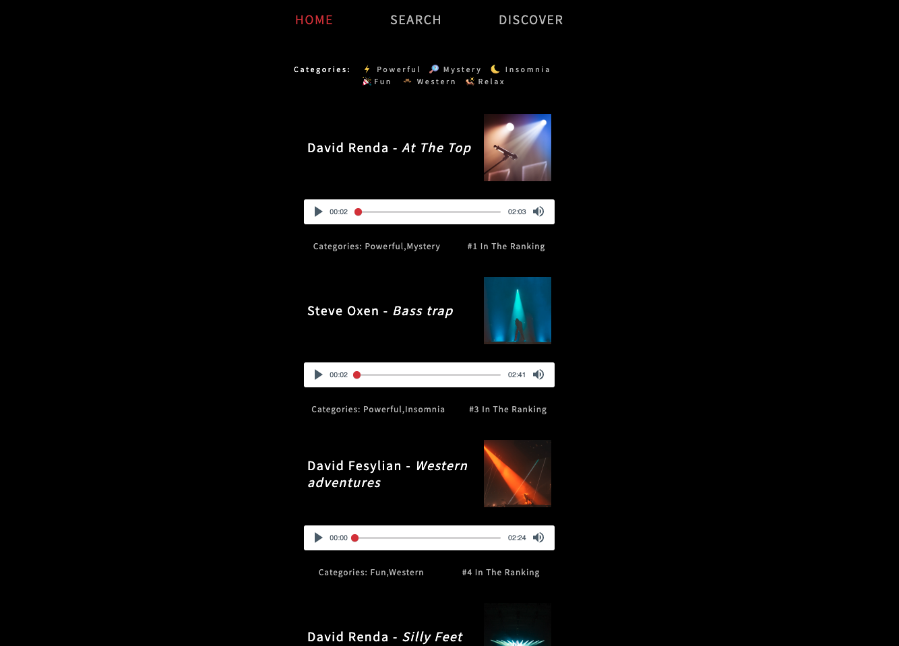
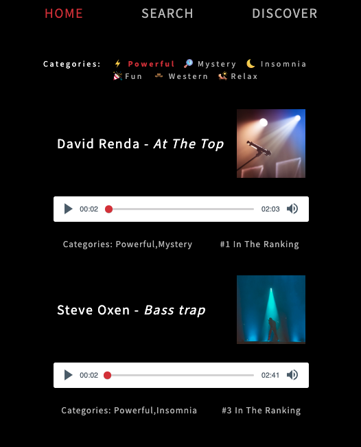
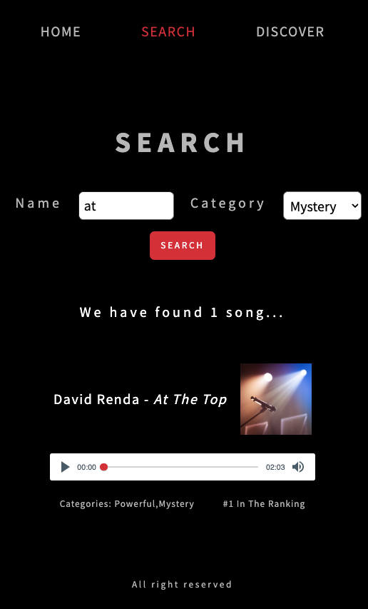

# Music APP

A website with music players built in Vanilla JS as a single-page application (SPA). 

## [Live Demo](https://music-app.lukaszkryskiewi.repl.co)

## Technologies

- Vanila JS
- HTML
- CSS/SCSS

## Overview

The Music app features:
* General 
  * Song playback functionality implemented using the green-audio-player
  * Only one song can be played at a time. Clicking on another song will stop the currently playing one
  * Display of song title, author, cover, categories and ranking position
  * All song data is fetched from a database 
  * RWD styles  
  &nbsp;
* Home 
  * Filter songs by categories. Clicking on a selected category again will reset the filter and display all songs  
  &nbsp;
* Search
  * Search songs by title and category. Shows information about the number of songs that match the filters and displays the list of filtered song  
    &nbsp;
* Discover
  * If the user has used more than 3 players on the homepage (each player can be used more than once, but not in a row), Discover selects random songs only from the category or categories that were listened to most frequently
  * If the user has used 3 or fewer players, Discover selects a random song from all songs  
  &nbsp;

Design is based on provided template with some additional featuers like album covers or categories icons.

## Screenshots

### Hero
  
  &nbsp;
### Home  
  
  &nbsp;
### Categories  
  
  &nbsp;
### Search  
  
  &nbsp;
### Discover  

